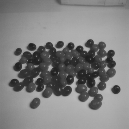

# Problem Set 0: Images as Functions

## Questions

### 1. Input Images
  
  

### 2. Color Planes
  
  
  

### 3. Replacement of Pixels
    
  
### 4. Arithmetic and Geometric Operations
  
  
  

### 5. Noise 
  
  